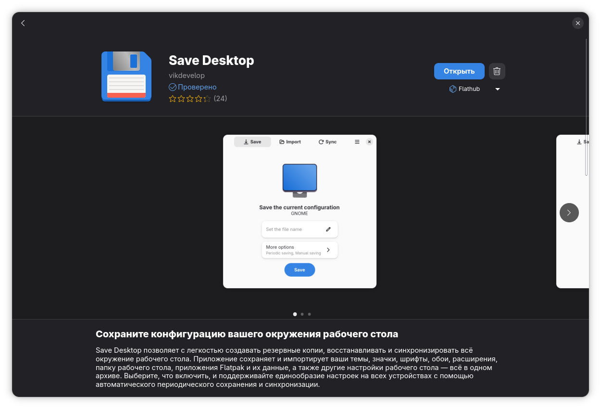
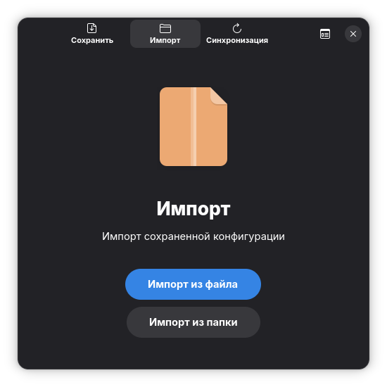
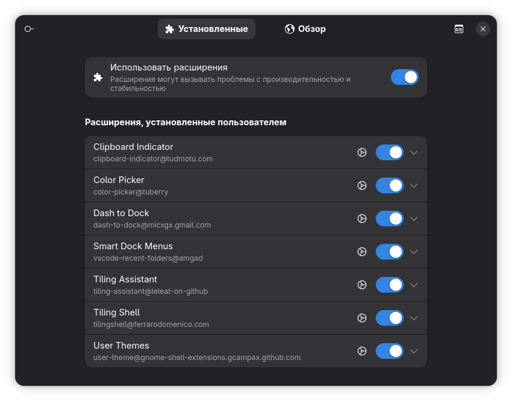

# Fedora GNOME Config Kai Speedrun
## О проекте
Это мой готовый настроенный конфиг для операционной системы **Linux Fedora**  
(версия GNOME 44 и выше).  

Здесь собрано краткое руководство по установке и описание того,  
что именно включено в данный конфиг.  

---

## Установка Save Desktop

Программа **Save Desktop** необходима для дальнейшего импорта конфигурации и применения моих настроек.  

### Описание
Save Desktop позволяет с лёгкостью создавать резервные копии, восстанавливать и синхронизировать всё окружение рабочего стола.  
Приложение сохраняет и импортирует ваши темы, значки, шрифты, обои, расширения, папку рабочего стола, приложения Flatpak и их данные, а также другие настройки рабочего стола - всё в одном архиве.  

Выберите, что включить, и поддерживайте единообразие настроек на всех устройствах с помощью автоматического периодического сохранения и синхронизации.  

---

## Импорт и применение конфига

[Скачать конфиг](fedora-config.sd.zip)

После установки приложения **Save Desktop** вы можете импортировать мой готовый конфиг напрямую из этого репозитория.  

### Примечание
Конфиг абсолютно стабилен и безопасен при правильном использовании.  
Он не вносит вредоносных изменений и предназначен только для настройки окружения рабочего стола Fedora GNOME.  

---

## Импорт конфигурации

Чтобы применить конфигурацию, необходимо открыть приложение **Save Desktop** и перейти в меню **Импорт**.  
После этого нажмите на кнопку «Импорт файла» (*или, если вы уже распаковали архив, выберите «Импорт из папки»*).  

Таким образом, все настройки будут автоматически применены к вашему окружению Fedora GNOME.  

---

## Установленные приложения и расширения

После импорта конфигурации автоматически будут добавлены следующие приложения:

➤ Spotify  
➤ Steam  
➤ Telegram  
➤ Sober  
➤ Sublime Text  
➤ Дополнительные настройки GNOME  
➤ Extension Manager  

### Примечание
Приложения могут установиться не сразу либо вовсе не установиться - это нормально.  
Некоторые пакеты и расширения могут больше не поддерживаться на определённых версиях GNOME.  
Если какое‑то приложение не установилось автоматически, вы можете спокойно доустановить его самостоятельно через стандартные средства Fedora.  

---

## Установленные расширения GNOME

После импорта конфигурации в **Extension Manager** будут доступны следующие расширения:

⟡ Clipboard Indicator - индикатор буфера обмена  
⟡ Color Picker - инструмент выбора цвета  
⟡ Dash to Dock - док‑панель для быстрого доступа  
⟡ Smart Dock Menus - расширенные меню для дока  
⟡ Tiling Assistant - помощник для управления окнами  
⟡ Tiling Shell - расширение для плиточной раскладки  
⟡ User Themes - поддержка пользовательских тем  

### Примечание
Все перечисленные расширения включены в конфиг и активируются автоматически.  
Однако в зависимости от версии GNOME некоторые из них могут работать нестабильно или не поддерживаться.  
Если какое‑то расширение не установилось или не включилось, вы можете спокойно добавить его вручную через Extension Manager.
